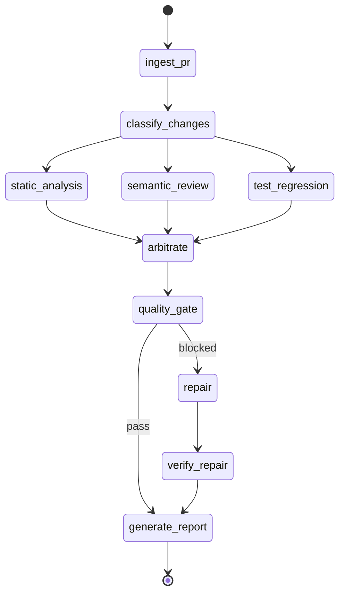

# 多智能体代码审查系统 (Multi-Agent Code Review System)

[](https://github.com/Egor-wang/multi-agent-code-review/actions/workflows/ci.yml)
[](https://python.org)
[](LICENSE)

基于 LangGraph 多智能体协作架构的自动化代码审查与缺陷修复系统。

> 不是一个"更好的 Lint 工具"，而是一个"可协作的虚拟审查团队"。

## 快速开始

```bash
# 安装依赖
pip install -r requirements.txt

# Mock Demo（无需 API Key，5 秒完成）
python scripts/demo.py

# 审查单个文件
python scripts/run_cli.py --file path/to/code.py

# 启动 API 服务器
python scripts/run_server.py
# → Swagger UI: http://localhost:8000/docs
# → Dashboard:  http://localhost:8000

# 运行测试
pytest tests/ -v
```

## 架构

```
PR/Code → Orchestrator (LangGraph)
              ├── Static Analysis Agent (Semgrep + Pylint + Tree-sitter)
              ├── Semantic Review Agent (LLM + RAG + ChromaDB)
              ├── Test & Regression Agent  (Coverage + Test Gen)
              └── Repair & Patch Agent     (Diff Gen + Verify)
              ↓
         Arbitration → Quality Gate → Report
```

## 四类审查 Agent

| Agent | 技术栈 | 输出 |
|-------|--------|------|
| **Static Analysis** | Semgrep, Pylint, Tree-sitter | 模式匹配缺陷 (SQL注入/风格/复杂度) |
| **Semantic Review** | LLM + RAG (ChromaDB) | 根因分析 + 历史相似案例引用 |
| **Test & Regression** | coverage.py + LLM | 测试缺口 + 自动生成测试用例 |
| **Repair & Patch** | LLM + Sandbox | Unified diff 补丁 + 语法/静态/沙箱三重验证 |

## 项目结构

```
├── config/                 # Settings + Agent YAML 配置
├── src/
│   ├── models/             # Pydantic 数据模型 (Issue/PR/Report/Patch)
│   ├── agents/             # 4 个 Agent (Base + Mock + Real 实现)
│   ├── orchestrator/       # LangGraph 状态机 (9 个节点)
│   ├── knowledge/          # RAG 引擎 + ChromaDB + 种子数据
│   ├── tools/              # Semgrep/Pylint/Tree-sitter/Sandbox
│   ├── llm/                # LLM 抽象 (Mock + DeepSeek with retry)
│   └── api/                # FastAPI 服务器 + Routes
├── prompts/                # Jinja2 Prompt 模板
├── tests/                  # 101 个测试 (单元 + 集成)
├── evaluation/             # 评估数据集 (12 样本) + 指标计算
├── docs/                   # 架构决策记录 + API 文档
├── static/                 # Web Dashboard (Chart.js)
├── docker/                 # Dockerfile + docker-compose
├── scripts/                # demo.py, run_cli.py, run_server.py
└── .github/workflows/      # CI (lint + type-check + test)
```

## 工作流状态机



## API 端点

| Method | Path | Description |
|--------|------|-------------|
| `GET` | `/api/v1/health` | Health check + agent status |
| `POST` | `/api/v1/review` | Submit code for review |
| `GET` | `/api/v1/review/{id}` | Review status |
| `GET` | `/api/v1/review/{id}/report` | Full review report (JSON) |
| `POST` | `/api/v1/webhook/github` | GitHub PR webhook |
| `GET` | `/api/v1/dashboard/stats` | Aggregate statistics |
| `GET` | `/api/v1/dashboard/history` | Recent review history |
| `GET` | `/docs` | Swagger UI |
| `GET` | `/` | Web Dashboard |

## 开发路线

- [x] **M1**: 骨架搭建 + Mock 全流程 + CLI
- [x] **M2**: 真实工具层 (Semgrep + Pylint + Tree-sitter)
- [x] **M3**: LLM + RAG 知识库 (ChromaDB + Jinja2 Prompts)
- [x] **M4**: 测试生成 + 自动修复 + 验证沙箱
- [x] **M5**: FastAPI + GitHub Webhook + Docker + Dashboard
- [x] **M6**: 评估体系 + Demo 脚本 + 文档
- [ ] **Future**: 真实 DeepSeek API 接入 (填入 DEEPSEEK_API_KEY 即可)

## 评估指标 (Mock 模式)

| 指标 | 值 |
|------|-----|
| 评估样本 | 12 个 (含 SQL注入/XSS/路径遍历/空指针/风格等) |
| 平均审查耗时 | ~200ms/样本 |
| 测试覆盖 | 101 tests, 0 failures |

> 注: Mock 模式下指标反映管道性能。接入真实 LLM 后将重新评估检测精度。

## 技术栈

- **编排**: LangGraph 1.2+
- **LLM**: DeepSeek-V3 (默认 Mock)
- **RAG**: ChromaDB + 自实现混合检索引擎
- **静态分析**: Semgrep + Pylint + Tree-sitter
- **后端**: FastAPI + Uvicorn
- **数据模型**: Pydantic v2
- **前端**: Chart.js (Dashboard)
- **部署**: Docker + docker-compose
- **CI**: GitHub Actions (lint + type-check + test)

## 许可证

MIT License — 详见 [LICENSE](LICENSE)
