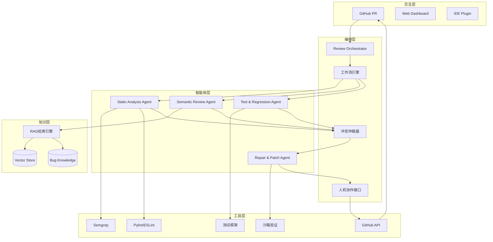
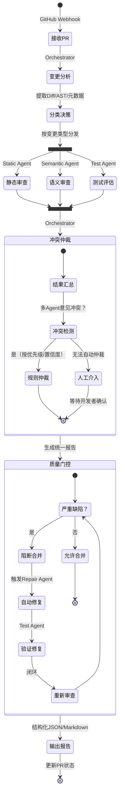
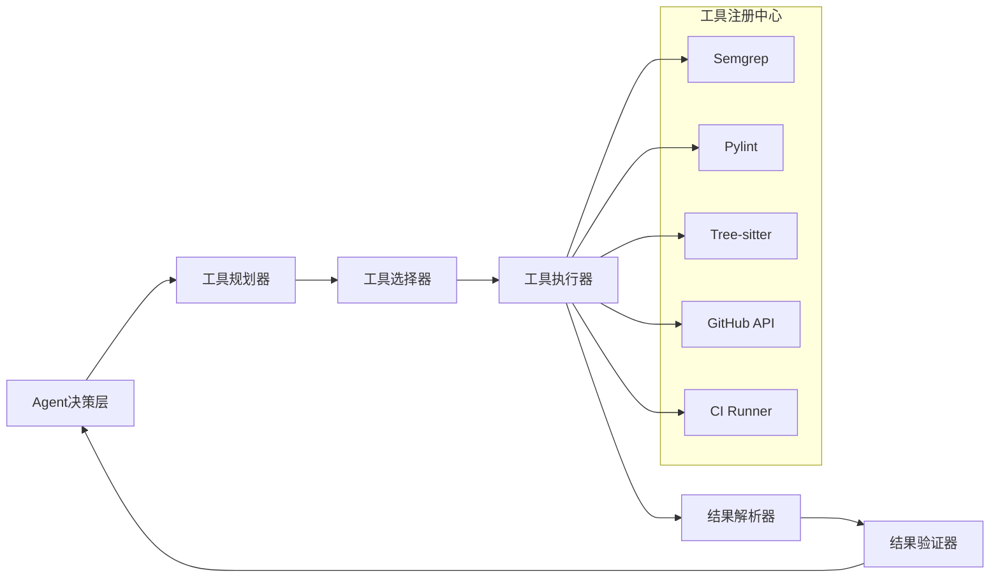

# 基于多智能体协作的自动化代码审查与缺陷修复系统
## 详细设计说明文档（DeepSeek版）

**版本**: v2.0  
**日期**: 2026-05-25  
**作者**: Egor-wang  
**仓库**: https://github.com/Egor-wang/multi-agent-code-review
**LLM选型**: DeepSeek-V3 / DeepSeek-Coder-V2

---

## 一、系统总体定位与核心价值

### 1.1 问题定义

当前代码审查（Code Review）面临三重困境：

| 困境 | 表现 | 根因 |
|------|------|------|
| **专家瓶颈** | 资深开发者审查耗时占开发周期30%+ | 领域知识集中于少数人 |
| **一致性差** | 不同审查者标准不一，漏检率高 | 依赖个人经验，缺乏标准化 |
| **反馈滞后** | 发现问题时缺陷已扩散至下游 | 审查发生在编码完成后 |

### 1.2 系统定位

> **不是一个"更好的Lint工具"，而是一个"可协作的虚拟审查团队"**

本系统通过**多智能体协作架构**，模拟真实代码审查团队中不同角色（安全专家、架构师、测试工程师）的专业分工与协作流程，实现：

- **分层审查**：静态规则 -> 语义分析 -> 动态验证 -> 自动修复
- **知识沉淀**：将历史审查经验转化为可检索、可复用的组织资产
- **人机协同**：AI处理模式化问题，人类聚焦架构决策与业务逻辑

### 1.3 核心价值主张

```
传统方案          本系统
-----------------------------------------
单模型补全    ->   多Agent专业分工
黑盒建议      ->   白盒推理过程
通用规则      ->   项目专属知识
一次性审查    ->   迭代式修复验证
```

---

## 二、多智能体角色划分与职责表

### 2.1 Agent 体系总览

```
+-------------------------------------------------------------+
|                    Review Orchestrator                       |
|                 (审查协调器 / 中央调度)                       |
+--------------+--------------+--------------+----------------+
               |              |              |
    +----------v----+  +-----v------+  +----v------+  +--------v------+
    |   Static      |  |  Semantic  |  |   Test    |  |    Repair     |
    |   Analysis    |  |   Review   |  |    &      |  |    & Patch    |
    |    Agent      |  |   Agent    |  | Regression|  |    Agent      |
    +---------------+  +------------+  +-----------+  +---------------+
```

### 2.2 各Agent详细设计

#### Agent 1: Static Analysis Agent (静态分析Agent)

| 维度 | 说明 |
|------|------|
| **核心职责** | 基于语法与结构规则，执行模式匹配式缺陷检测 |
| **审查维度** | 安全性（注入漏洞、敏感信息泄露）、可维护性（圈复杂度、重复代码）、规范性（命名、格式） |
| **输入** | 代码变更Diff、文件AST、项目语言类型 |
| **输出** | 结构化缺陷列表（位置、规则ID、严重程度、修复模板） |
| **技术栈** | Tree-sitter（AST解析）、Semgrep（模式匹配）、Pylint/ESLint（语言特定规则） |
| **协作关系** | 向Orchestrator提交初步缺陷候选；为Semantic Agent提供可疑位置标记 |
| **设计理由** | 静态分析具有确定性、低误报、可解释的优势，适合作为审查第一道防线 |

#### Agent 2: Semantic Review Agent (语义审查Agent)

| 维度 | 说明 |
|------|------|
| **核心职责** | 理解代码语义与业务逻辑，识别设计模式违规、逻辑错误、API误用 |
| **审查维度** | 正确性（空指针、并发竞态）、性能（算法复杂度、N+1查询）、架构一致性 |
| **输入** | AST + CFG（控制流图）、变更上下文（相邻函数、调用链）、RAG检索结果（历史相似Bug） |
| **输出** | 语义级审查意见（含根因分析、影响面评估、修复建议） |
| **技术栈** | DeepSeek-V3（通用语义理解）+ DeepSeek-Coder-V2（代码专用）+ RAG检索 + 程序分析（数据流分析） |
| **协作关系** | 接收Static Agent的可疑点进行深度分析；向Repair Agent输出修复上下文 |
| **设计理由** | 弥补静态分析无法理解业务逻辑的短板，是"AI价值"的核心体现 |

#### Agent 3: Test & Regression Agent (测试与回归Agent)

| 维度 | 说明 |
|------|------|
| **核心职责** | 评估变更的测试覆盖度，生成缺失测试，预测回归风险 |
| **审查维度** | 测试覆盖率、边界条件、回归风险、兼容性影响 |
| **输入** | 变更代码、现有测试套件、代码覆盖率报告、CI历史数据 |
| **输出** | 测试缺口报告、生成的测试用例（代码）、回归风险评级 |
| **技术栈** | Coverage.py/JaCoCo（覆盖率）、DeepSeek-Coder-V2（测试生成）、变异测试（Mutation Testing） |
| **协作关系** | 为Repair Agent提供测试验证标准；向Orchestrator报告"可合并性"评估 |
| **设计理由** | 审查的终极目标是保证质量，测试是质量的可量化证明 |

#### Agent 4: Repair & Patch Agent (修复与补丁Agent)

| 维度 | 说明 |
|------|------|
| **核心职责** | 基于审查意见生成可应用的代码修复补丁，并验证修复有效性 |
| **审查维度** | 修复正确性、最小侵入性、风格一致性 |
| **输入** | 原始代码、审查意见（含位置与类型）、项目编码规范、测试用例 |
| **输出** | 统一Diff格式的修复补丁、修复解释（自然语言）、验证结果 |
| **技术栈** | DeepSeek-Coder-V2（代码生成）、Tree-sitter（确保语法正确性）、沙箱执行验证 |
| **协作关系** | 接收Semantic Agent的修复建议；请求Test Agent验证修复；向Orchestrator提交修复候选 |
| **设计理由** | 从"发现问题"到"解决问题"闭环，体现工程实用性 |

#### Agent 5: Review Orchestrator (审查协调器)

| 维度 | 说明 |
|------|------|
| **核心职责** | 工作流调度、冲突消解、质量门控、人机协作接口 |
| **核心功能** | 1. 变更分类与Agent分发 2. 结果汇总与去重 3. 冲突仲裁 4. 迭代控制 5. 人工介入点管理 |
| **输入** | PR元数据、各Agent输出、人工反馈、项目策略配置 |
| **输出** | 统一审查报告、质量门控决策（通过/需修改/阻断）、待人工确认项 |
| **技术栈** | LangGraph（状态机编排）、规则引擎（冲突消解）、优先级队列 |
| **协作关系** | 所有Agent的中央调度节点；与GitHub API交互更新PR状态 |
| **设计理由** | 多Agent系统的"操作系统"，决定协作效率与系统可靠性 |

---

## 三、系统总体架构图

### 3.1 分层架构（文字版）

```
+----------------------------------------------------------------------+
|                      交互层 (Presentation)                          |
|  GitHub PR界面  |  Web Dashboard  |  IDE插件  |  CLI工具            |
+----------------------------------------------------------------------+
                                    |
                                    v
+----------------------------------------------------------------------+
|                      编排层 (Orchestration)                         |
|  Review Orchestrator | 工作流引擎 | 冲突仲裁器 | 人机协作接口        |
+----------------------------------------------------------------------+
                                    |
                    +---------------+---------------+
                    |               |               |
                    v               v               v
+-------------------------+ +-------------+ +-------------------------+
|      智能体层 (Agents)   | |  知识层    | |      工具层 (Tools)      |
| +-----+ +-----+ +-----+ | |  (RAG)     | | +-----+ +-----+ +-----+ |
| |Static| |Semantic| |Test| | +-------+ | | |Semgrep| |Pylint| |JUnit| |
| +-----+ +-----+ +-----+ | | |Code   | | | +-----+ +-----+ +-----+ |
| +-----+                 | | |Vector | | | +-----+ +-----+ +-----+ |
| |Repair|                | | |Store  | | | |Git  | |CI   | |Sandbox| |
| +-----+                 | | +-------+ | | |API  | |Hook | |       | |
+-------------------------+ +-------------+ +-------------------------+
                                    |
                                    v
+----------------------------------------------------------------------+
|                      数据层 (Data)                                  |
|  代码仓库  |  审查历史库  |  Bug知识库  |  规则库  |  配置中心       |
+----------------------------------------------------------------------+
```

### 3.2 Mermaid架构图



---

## 四、Agent协作工作流（状态机设计）

### 4.1 核心工作流：PR审查流水线



### 4.2 迭代修复循环（关键创新点）

```
第1轮审查
    Static Agent 发现: SQL注入风险 @ line 45
    Semantic Agent 确认: 用户输入未过滤直接拼接
    Test Agent 报告: 缺少安全测试用例

    -> Orchestrator决策: 阻断合并，触发修复

第1轮修复
    Repair Agent生成: 参数化查询补丁
    Test Agent验证: 新增测试通过，回归测试通过

    -> Orchestrator决策: 进入重审

第2轮审查（Re-review）
    Static Agent: 注入风险已消除
    Semantic Agent: 修复符合项目规范，但建议添加输入长度校验
    Test Agent: 新测试覆盖边界条件

    -> Orchestrator决策: 降级为警告，允许合并，附改进建议
```

### 4.3 失败回退策略

| 失败场景 | 回退策略 | 保障机制 |
|----------|----------|----------|
| Agent执行超时 | 标记为"未完成"，人工介入 | 超时配置（30s/Agent） |
| LLM API不可用 | 降级为纯静态分析模式 | 本地规则库兜底 |
| 工具调用失败 | 跳过该Agent，其他Agent继续 | 熔断机制 |
| 修复验证失败 | 回滚修复，保留审查意见 | 沙箱隔离执行 |
| 冲突无法仲裁 | 提升为"需人工决策" | 人工优先级最高 |

---

## 五、RAG与知识增强设计

### 5.1 三层知识库架构

```
+-------------------------------------------------------------+
|                    知识检索层 (RAG Engine)                   |
|              混合检索: 向量相似度 + 关键词 + 规则匹配         |
+--------------+------------------+---------------------------+
               |                  |
    +----------v----------+  +----v----------------------+
    |   项目规范知识库    |  |     历史缺陷知识库        |
    |  (Project Rules)   |  |    (Bug Knowledge)        |
    +--------------------+  +--------------------------+
    | - 编码规范文档      |  | - 历史Issue与Root Cause   |
    | - API使用约定       |  | - 典型Bug模式             |
    | - 架构决策记录(ADR) |  | - 修复方案与验证结果      |
    | - 代码审查Checklist |  | - 误报案例（避免重复）    |
    +--------------------+  +--------------------------+
```

### 5.2 知识编码与检索策略

**向量化策略**（避免幻觉的关键）：

| 知识类型 | 编码方式 | 检索触发条件 |
|----------|----------|--------------|
| 代码规范 | 规范文本 + 正/反例代码片段 | Semantic Agent审查时 |
| 历史Bug | Bug描述 + 问题代码 + 修复Diff + 根因标签 | 代码相似度匹配 |
| 架构约束 | ADR文档 + 关键接口定义 | 涉及架构变更时 |
| 审查经验 | 审查意见 + 采纳结果 | 同类变更模式识别 |

**防幻觉机制**：

1. **检索结果约束**：LLM生成时必须引用检索到的具体规范条目或历史案例ID
2. **验证闭环**：Repair Agent生成的修复必须通过静态分析工具验证，确保语法正确
3. **置信度阈值**：检索相似度<0.7时，标记为"推测性建议"，不自动修复
4. **人工确认点**：涉及安全修复时，必须人工确认后方可应用

### 5.3 知识沉淀流程

```
人工审查PR
    |
Orchestrator记录: 审查意见 + 采纳结果 + 最终代码
    |
知识提取Agent: 识别有价值的模式（新Bug类型/有效修复方案）
    |
人工审核（轻量）: 确认知识质量
    |
入库: 更新Vector Store + 规则库
    |
后续审查自动应用
```

---

## 六、工具调用与工程集成

### 6.1 工具调用架构（Tool Use）



### 6.2 工具调用协议

每个工具封装为统一接口：

```python
class ToolInterface:
    def plan(self, context: ReviewContext) -> ToolPlan:
        # 基于上下文决定是否需要调用
        pass

    def execute(self, plan: ToolPlan) -> RawResult:
        # 执行工具，返回原始输出
        pass

    def parse(self, raw: RawResult) -> StructuredResult:
        # 解析为Agent可理解的结构化数据
        pass

    def validate(self, result: StructuredResult) -> bool:
        # 验证结果有效性（防止工具误报/执行失败）
        pass
```

### 6.3 与GitHub/CI的深度集成

```
开发者提交PR
    |
GitHub Webhook -> 本系统FastAPI接口
    |
Orchestrator创建审查任务
    |
并行执行Agent审查（异步，不阻塞CI）
    |
审查完成 -> GitHub Checks API提交状态
    |
PR界面显示: 通过 / 需修改 / 有警告
    |
开发者点击"查看详情" -> 结构化审查报告
    |
（可选）点击"应用修复" -> Repair Agent生成PR建议修改
```

---

## 七、评估与可信度设计

### 7.1 多维度评估体系

| 维度 | 指标 | 测量方法 |
|------|------|----------|
| **审查准确率** | 精确率(Precision) / 召回率(Recall) | 与人工审查结果对比，F1-score |
| **修复成功率** | 语法正确率 / 测试通过率 / 语义等价率 | 沙箱执行 + 变异测试 |
| **误报率** | 无效审查意见占比 | 开发者标记"无用"/"误报" |
| **效率提升** | 平均审查时间 / 发现问题阶段前移率 | 与纯人工审查对比 |
| **可解释性** | 审查意见含根因分析的比例 | 人工评分 |

### 7.2 可信度分级机制

```
阻断级 (Blocker): 静态分析确认 + Semantic Agent高置信度 -> 必须修复
警告级 (Warning): 单Agent发现，未交叉验证 -> 建议修复，需人工确认
建议级 (Suggestion): 模式匹配/推测性建议 -> 参考性意见
信息级 (Info): 规范提示/最佳实践 -> 仅供参考
```

### 7.3 可解释性设计（Explainability）

每条审查意见必须包含：

```json
{
  "issue_id": "SEC-2024-001",
  "type": "SQL注入",
  "severity": "阻断",
  "location": "src/auth.py:45",
  "root_cause": "用户输入`username`直接拼接至SQL语句，未经过参数化处理",
  "evidence": {
    "code_snippet": "query = f'SELECT * FROM users WHERE name = "{username}"'",
    "ast_path": "FunctionDef:login -> Assign:query -> JoinedStr",
    "similar_bug": "Issue#234: 2023-08 生产环境SQL注入事件"
  },
  "fix_suggestion": {
    "diff": "@@ -45,3 +45,3 @@...",
    "explanation": "使用参数化查询，将用户输入与SQL逻辑分离，从根本上消除注入风险",
    "references": ["OWASP-Cheatsheet: SQL Injection Prevention"]
  },
  "confidence": 0.95,
  "verification": {
    "static_check": "通过",
    "test_result": "新增测试test_sql_injection_prevention: 通过"
  }
}
```

---

## 八、关键技术选型与设计理由

| 技术组件 | 选型 | 设计理由 |
|----------|------|----------|
| **多智能体框架** | LangGraph | 状态机模型天然适合审查流程的复杂分支与回退；与LangChain生态无缝集成；社区活跃，学术认可度高 |
| **LLM** | DeepSeek-V3 / DeepSeek-Coder-V2 | 国产顶尖模型，代码理解能力对标GPT-4；支持128K上下文；API成本仅为OpenAI 1/10；中文场景优化 |
| **代码解析** | Tree-sitter | 增量解析速度快，支持多语言，AST精度高，适合构建代码知识库 |
| **向量数据库** | Chroma（初期）-> Milvus（扩展） | 轻量起步，后期可横向扩展；支持混合检索 |
| **静态分析** | Semgrep + 语言特定Linter | Semgrep规则可自定义，适合项目特定模式；Linter提供确定性基础检查 |
| **后端服务** | FastAPI | 异步支持Webhook高并发；类型提示提升代码质量；生态成熟 |
| **部署** | Docker + GitHub Actions | 容器化保证环境一致；CI/CD实现审查流程自动化 |

---

## 九、与工业方案对比优势

| 维度 | SonarQube | CodeRabbit | **本系统** |
|------|-----------|------------|------------|
| **架构模式** | 单体式规则引擎 | 单模型+模板 | **多Agent协作，角色分工** |
| **审查深度** | 语法/结构层 | 语义层（LLM） | **分层递进：静态->语义->测试->修复** |
| **知识能力** | 预置规则库 | 通用LLM知识 | **RAG增强，项目专属知识沉淀** |
| **修复能力** | 无 | 简单建议 | **生成可验证的Diff补丁** |
| **可解释性** | 规则ID引用 | 自然语言解释 | **结构化根因分析+证据链** |
| **人机协作** | 被动报告 | 被动评论 | **主动仲裁+迭代修复+人工介入点** |
| **开源可控** | 部分开源 | 闭源商业 | **全栈开源，可深度定制** |

**核心差异化**：工业方案追求"通用性"，本系统追求**"领域深度+工程可控性"**，更适合作为科研探索与垂直场景落地的原型。

---

## 十、保研展示设计亮点总结

### 10.1 一句话概括每个模块

| 模块 | 一句话说明 |
|------|------------|
| Review Orchestrator | "审查团队的项目经理，负责任务分发与冲突协调" |
| Static Analysis Agent | "语法专家，用确定性规则快速筛查明显缺陷" |
| Semantic Review Agent | "架构专家，理解业务逻辑，发现深层设计问题" |
| Test & Regression Agent | "质量守门员，确保变更不会破坏现有功能" |
| Repair & Patch Agent | "自动修复工程师，生成可验证的代码补丁" |
| RAG知识库 | "组织经验沉淀器，让历史教训不再重复发生" |

### 10.2 架构图展示建议

**面试时手绘或展示**：

```
[展示要点]
1. 先画分层架构（交互层->编排层->智能体层->知识层->工具层）
2. 强调"分层审查"理念：静态规则（确定性）->语义理解（智能性）->测试验证（可靠性）->自动修复（闭环性）
3. 用颜色区分：蓝色=确定性组件，橙色=AI组件，绿色=人工介入点
```

### 10.3 Demo演示流程（5分钟版本）

```
第1分钟: 展示系统架构图，说明"为什么是多Agent而非单模型"
第2分钟: 输入一段含SQL注入的代码变更，展示Static Agent秒级检出
第3分钟: 展示Semantic Agent的根因分析（引用OWASP规范+历史Bug案例）
第4分钟: 展示Repair Agent生成参数化查询补丁，Test Agent验证通过
第5分钟: 展示迭代审查：修复后Re-review确认安全，系统允许合并
```

### 10.4 保研面试高频问题预设

**Q: 为什么不用一个强大的LLM直接做审查？**  
A: 单一LLM存在幻觉、成本高、不可控的问题。多Agent架构将确定性任务（静态分析）交给规则引擎，将智能任务（语义理解）交给LLM，实现**可控成本下的最大智能**。

**Q: 如何防止AI生成错误的修复？**  
A: 三层防护：1. 修复必须通过静态分析语法检查 2. 必须在沙箱中通过测试验证 3. 安全类修复必须人工确认。我们追求**"可验证的自动化"而非"全自动"**。

**Q: 与Copilot/CodeRabbit的区别？**  
A: 它们是"代码补全工具"或"评论机器人"，我们是"审查工作流系统"。核心差异在于**状态机编排、多轮迭代、知识沉淀、闭环修复**。

---

## 附录：项目里程碑规划

| 阶段 | 周期 | 目标 | 可展示成果 |
|------|------|------|------------|
| **M1: 骨架搭建** | 第1-2周 | 项目结构、README、Orchestrator框架 | 架构文档+空转状态机 |
| **M2: 静态审查** | 第3-4周 | Static Agent + Semgrep集成 | 输入代码->输出缺陷列表 |
| **M3: 语义增强** | 第5-6周 | Semantic Agent + RAG检索 | 含根因分析的审查意见 |
| **M4: 测试闭环** | 第7-8周 | Test Agent + Repair Agent | 生成测试+修复补丁 |
| **M5: 系统集成** | 第9-10周 | GitHub Webhook + Dashboard | 完整PR审查Demo |
| **M6: 评估优化** | 第11-12周 | 对比实验、指标优化 | 实验报告+论文初稿 |

---

*本文档作为系统设计基准，后续开发中可根据实际约束调整技术细节，但核心架构与设计理念保持不变。*
